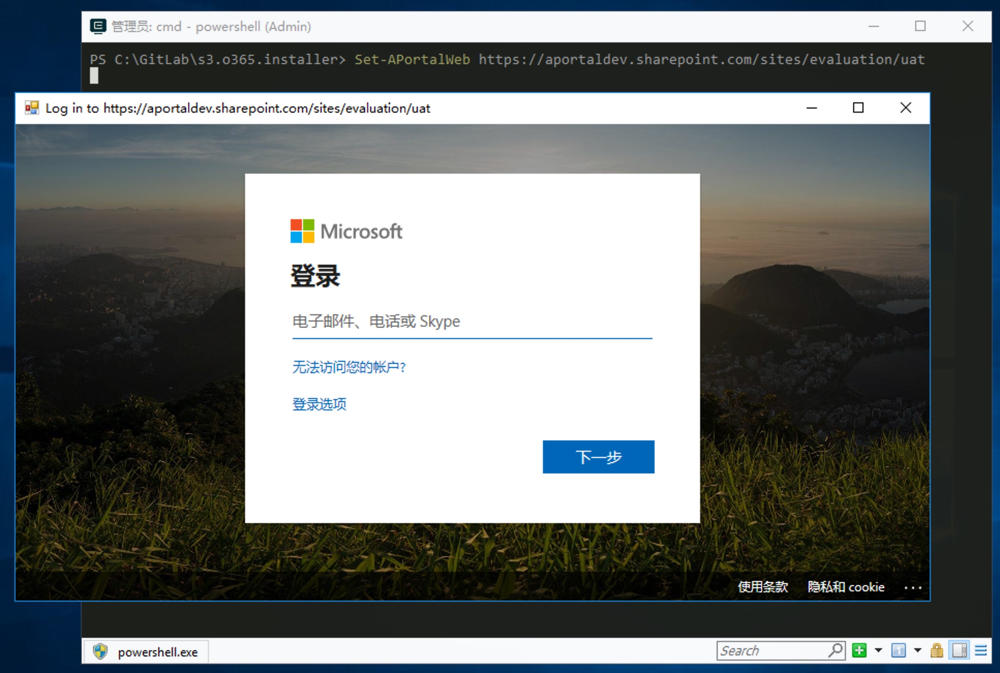
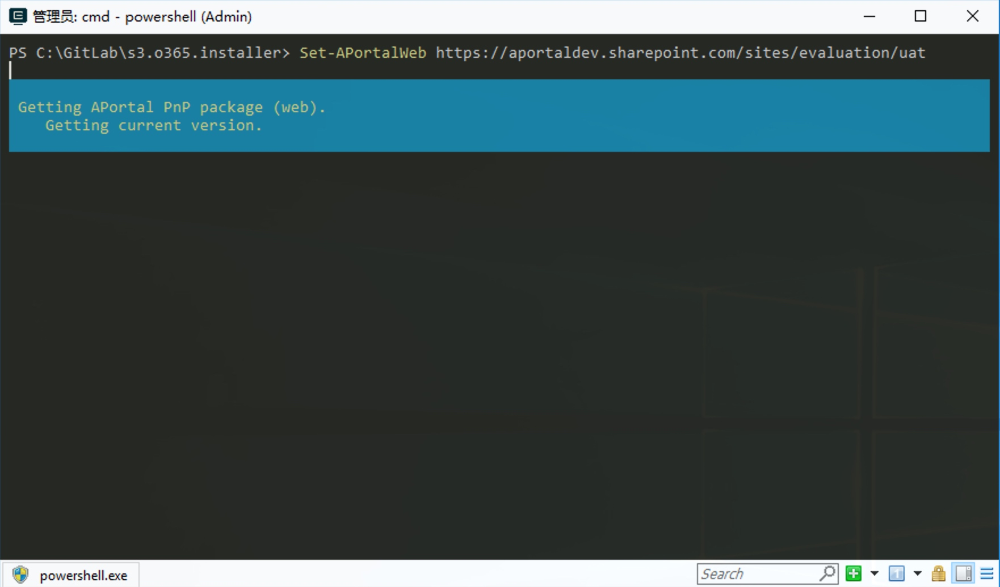

## 导语

在安装 APortal 之前，请仔细阅读本系列文章第一篇 ，根据实际需求谨慎选择安装环境，因为安装 APortal 会在相应的网站生成列表和推送网站资源，如果是已经存在的生产网站，可能会造成不可逆转的数据混淆。

## 安装 APortal.PowerShell

安装 APortal 使用 PowerShell 标准的包管理工具，我们针对 APortal 产品提供了一个叫做 `APortal.PowerShell`的 PowerShell 模块，且维护在 [PowerShellGallery](https://www.powershellgallery.com/packages/APortal.PowerShell) 上。

### 安装模块前环境准备

`APortal.PowerShell` 模块依赖 `SharePointPnPPowerShellOnline`模块，因此目前只能在 Windows 环境下执行。

#### 操作系统

* Windows 10
* Windows 2012 及以上

#### PowerShell 版本

* 5.0 
* 5.1

#### .Net Framework 版本

* 4.5 及以上
* 不支持 .NET Core

#### SharePointPnPPowerShellOnline 版本

* 3.13.1909
* 不需要手工安装，在安装 `APortal.Powershell` 包的时候会自动安装

### 安装模块

准备好安装环境后，安装过程就十分简单，只需要运行安装命令即可。

```powershell
# 安装最新版本
Install-Module -Name APortal.PowerShell
# 安装特定版本
Install-Module -Name APortal.PowerShell -RequiredVersion 0.0.9
```

安装完成后，可以使用命令确认模块是否安装正确。

```powershell
Get-Module -Name APortal.PowerShell -ListAvailable
```

## 使用 APortal.PowerShell


安装好 `APortal.PowerShell` 模块后，就可以使用模块包中提供的命令对网站进行设置 APortal。下面介绍 APortal.PowerShell 模块中包含的可用命令。


### Set-APortalWeb

这是 `APortal.PowerShell` 模块中提供的最主要命令，用于设置SharePoint Online网站的 APortal 功能，会在用户输入的网站地址对应的网站上推送列表，网站资源，列表数据等一系列的网站数据。


1. 输入命令

    ```powershell
    # 国际网站
    Set-APortalWeb https://yourtenantname.sharepoint.com/sites/web/subweb
    # 世纪互联网站
    Set-APortalWeb https://yourtenantname.sharepoint.cn/sites/web/subweb
    ```

2. 在弹出的身份认证窗口中输入网站管理员身份信息
{% fullimg images/media/15779286287197/15779316086252.jpg,  class, 80%,80% %}
<!--  -->

1. 确认管理员身份后命令开始执行，直到推送结束
{% fullimg images/media/15779286287197/15779323142997.jpg,  class, 80%,80% %}
<!--  -->

